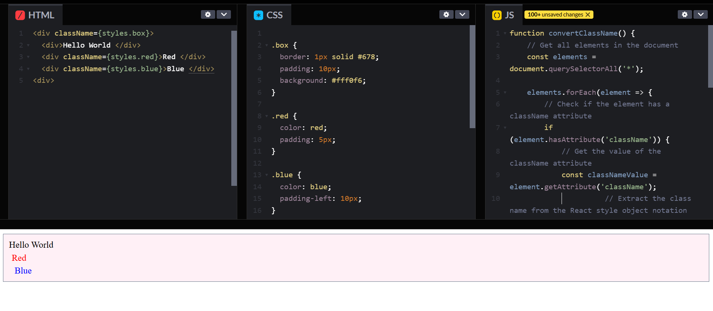

# ClassName to Class Converter for React CSS Testing

## Problem Description

When working with React, CSS classes are applied using the `className` attribute, as opposed to the standard HTML `class` attribute. However, many online editors or HTML environments that are used for testing and prototyping require the use of the `class` attribute instead of `className`.

This creates a repetitive and time-consuming problem:
1. **Conversion**: You need to manually change every `className` attribute to `class` to properly test your CSS in these environments.
2. **Reverting**: After testing, you have to manually change `class` back to `className` to integrate the code back into your React project.

## Solution

To streamline this process, a JavaScript function can be used to automatically convert all `className` attributes in your HTML to `class` attributes, allowing you to seamlessly test your CSS in the online editor without manually altering your code.

### JavaScript Code

```javascript
function convertClassName() {
    // Get all elements in the document
    const elements = document.querySelectorAll('*');
    
    elements.forEach(element => {
        // Check if the element has a className attribute
        if (element.hasAttribute('className')) {
            // Get the value of the className attribute
            const classNameValue = element.getAttribute('className');
            
            // Extract the class name from the React style object notation
            const className = classNameValue.replace(/^{styles\.([a-zA-Z0-9_-]+)}$/, '$1');
            
            // Set the class attribute with the extracted class name
            element.setAttribute('class', className);
            
            // Remove the className attribute
            element.removeAttribute('className');
        }
    });
}

// Call the function to convert all className attributes to class
convertClassName();
```

## How to Use It
1. **Copy the Code**: Paste the above JavaScript code into the JS section of your online editor.
2. **Run the Script**: After pasting your React code into the HTML section,if it is not automatically triggers then run the script to automatically convert className to class.
3. **Test Your CSS**: Now just code as you code in React With the className attributes, it will convertes to class for css, you can freely test your CSS in the online editor.

